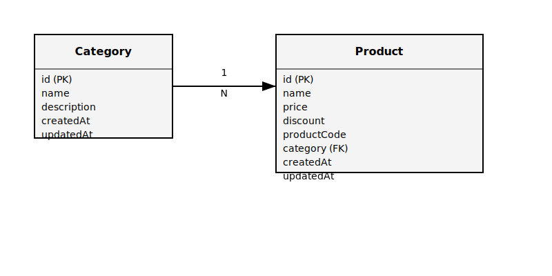

# Backend Challenge

## Overview
This project is a backend application for managing products and categories. It provides RESTful APIs to perform CRUD operations on products and categories. The application is built using Node.js and Express.js, with MongoDB as the database.

## Features
- Manage Products:
  - Create, Read, Update, and Delete products.
  - Automatically generate unique product codes based on the product name.
- Manage Categories:
  - Create, Read, Update, and Delete categories.
- Virtual fields for computed properties (e.g., final price after discount).

## Project Structure
```
├── controllers\
│   ├── categoryController.js
│   └── productController.js
├── middleware\
│   └── validation.js
├── models\
│   ├── Category.js
│   └── Product.js
├── routes\
│   ├── categoryRoutes.js
│   └── productRoutes.js
├── utils\
│   ├── findLongestIncreasingSubstring.js
│   └── generateProductCode.js
├── server.js
└── images\
    └── ER_diagram.svg
```

## ER Diagram
Below is the Entity-Relationship (ER) diagram for the project:



## How to Run
1. Clone the repository:
   ```bash
   git clone <repository-url>
   ```
2. Install dependencies:
   ```bash
   npm install
   ```
3. Start the server:
   ```bash
   node server.js/npm run dev
   ```
4. Access the API at `http://localhost:3000`.

## API Endpoints
### Root Route
- **GET /**: Returns a welcome message.

### Product Routes
- **GET /api/products**: Fetch all products.
- **POST /api/products**: Create a new product.
- **GET /api/products/:id**: Fetch a product by ID.
- **PUT /api/products/:id**: Update a product by ID.
- **DELETE /api/products/:id**: Delete a product by ID.

### Category Routes
- **GET /api/categories**: Fetch all categories.
- **POST /api/categories**: Create a new category.
- **GET /api/categories/:id**: Fetch a category by ID.
- **PUT /api/categories/:id**: Update a category by ID.
- **DELETE /api/categories/:id**: Delete a category by ID.
